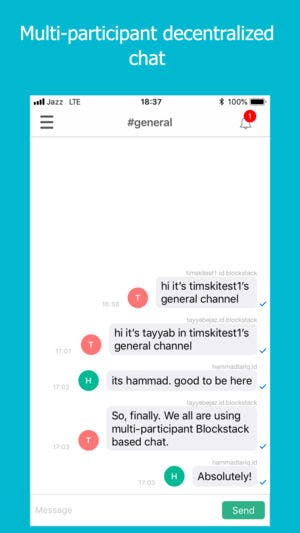
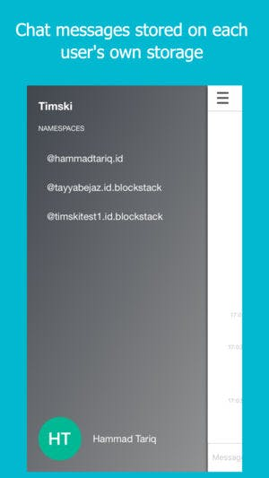
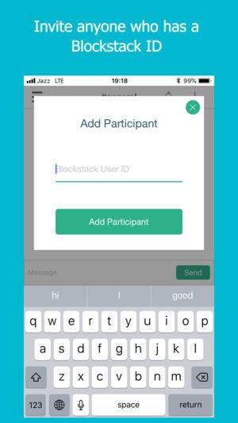

# Timski

## Demo Video

## Screenshots
  

Timski was a group chat app developed solely over Blockstack blockchain using Gaia hub storage. The app allows a user to create multiple groups, add and invite other Blockstack users to the groups and have real-time multi-participant chat.

The concept of the app is to use each user's own storage configured through Blockstack. The app then pulls each user's chat message from user's own storage, sort it based over timestamp and allow one to chat with other users.

This implementation of app does not use any third party service providers such as Firebase or Heroku to stay away from centralized services. This implementation also does not have iOS native notifications built into it.

The app does require a central service to keep track of invitations sent to other users.

The app is built using Swift and XCode.

The app was pulled from iOS store on 1st February 2019 due to the lack of the funding.

It's available under MIT License.
